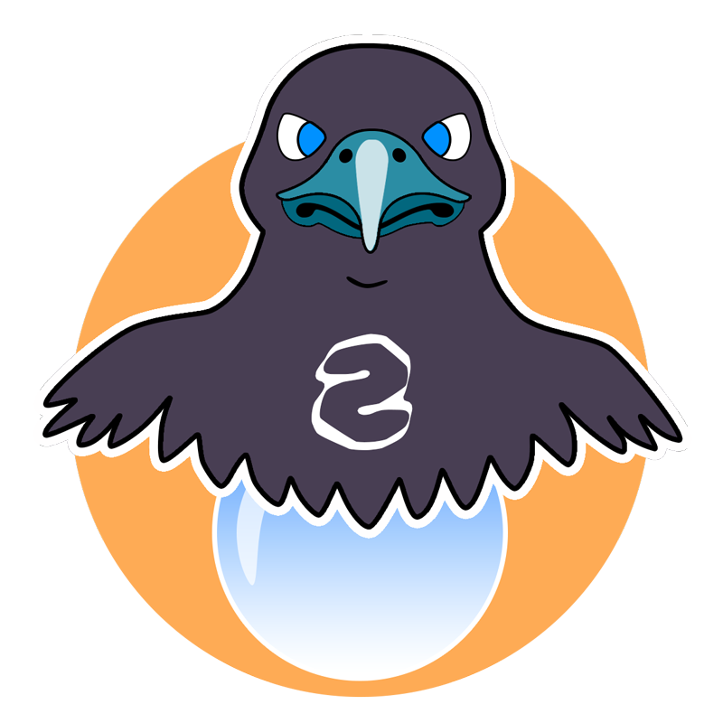

 

  

# SEER SAVIOR MERN PROJECT

Seer savior is a small web memory and deduction game developed in mobile first.
In this first version, the player must guess the expected answer using as few clues as possible to obtain the best possible score.

The application, developed in React, allows user to play all levels of the game, even offline.
However, if the player is offline, his progress will not be saved.

The player can create an account if he wishes to save his scores, appear in the high score table or even unlock and use personalized avatars.

He can also modify his data (email, nickname, password, personalized avatar) or even delete his account (all his data will then be completely deleted, including the personalized avatars that he may have uploaded).

This project allowed me to learn how to create a MERN application, and thus understand the backend logic.

## TECHNOLOGIES :

- Node (Version v18.14.1)
- Express
- MongoDB with mongoose
- jsonwebtoken
- Bcrypt
- cors
- dotenv
- cookie-parser
- multer
- validator
- cloudinary
- React

## DEPLOYMENT

This application has been deployed on Vercel. You can consult it here : https://seer-savior.vercel.app
